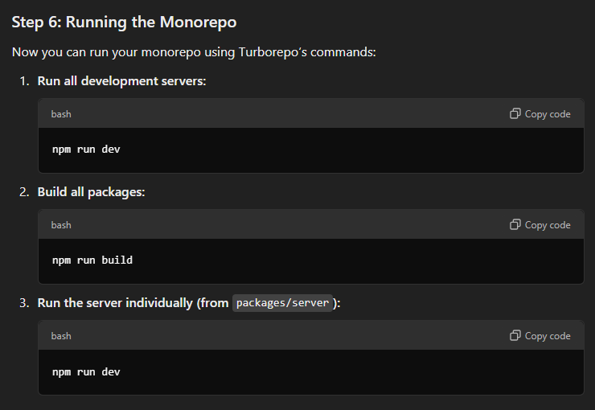
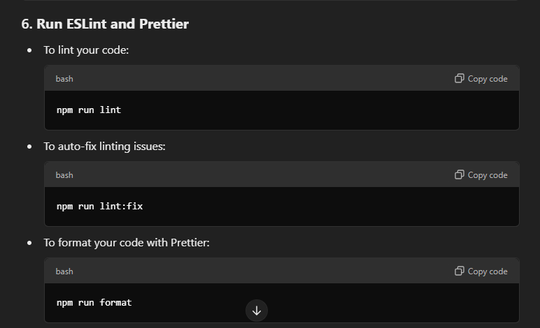

First time using:
-TypeScript
-TailwindCSS (disabled tailwind fold just so i can see the css for noob like me)
-Axios
-Turborepo (monorepo)

### Todo:

    ✅❌
    ✅ Set up restore terminal on public client and server, removed sql, and commented out private client + p-studio
    ✅ Set up github
    ✅ Set up simple server and create main dashboard
    ✅ Create simple db and set up prisma
    ✅ Created task ctrl+alt+f for npm run format
    ✅ Setup prisma db, create route, controller, and query for get and post posts
    ✅ Write seed file to query db for posts with starting data
    ✅ Connect server db to front end
    ✅ Create footer and header
    ✅ Create postcard for articles in dashboard and article pages
    ✅ Style HomePage and components
    ✅ Seed test data for dashboard
    ✅ Add post loading animation
    ✅ Create individual article pages
    ✅ Work on comments section components for article pages
        ✅ Create comment MVC that attaches comments to posts id
    ✅ Link sign up and login to redirect to the private client and logout redirects to public client
      ✅ Fix issue with redirecting to private client but not redirecting to public client
    ✅ Create auth and login/signup pages
        ✅ Allow users to sign up and log in
        ✅ Implement passport to authenticate users
        ✅ Use JWT for auth
    ✅ Create Post blog page
    ✅ Create all blogs page with pagination and sorting
    ❌ Allow users to edit their own posts
    ✅ Validate front end login and signup form and showcase errors
    ✅ Validate back end signup form and showcase errors
    ✅ Add comments count to PostCard components
    ❌ Add TinyMCE editor to create blog
    ❌ sligh problem directing to create blog page from public and also when publishing the artciles

# Monorepop set up:

    -Installing dependencies (yarn install or npm install).
    -Running the development server (turbo run dev).
    -Building the project (turbo run build).

- Check out iconify for icons: https://iconify.design/ or reacticons
- npx kill-port 3000 to kill server if already in use
- if private build not working: "build": "vite build",
- script to remove js and d.ts from src:

  - find src -name '\*.js' -type f -delete
  - find src -name '\*.d.ts' -type f -delete

- https://picsum.photos/ cool random image generator
- https://logo.com/editor/colors logo + favicon

tailwind:

- https://flowbite.com/
- https://tailwindui.com/
- https://www.material-tailwind.com/

Code for protected routes:

<!-- import { Router } from 'express';
import { authenticateJWT } from '../middleware/authMiddleware';
import { createPost } from '../controllers/postController';

const router = Router();

// Protect the /create-post route, only accessible if the JWT token is valid
router.post('/create-post', authenticateJWT, createPost);

export default router; -->

. Accessing the Token Later:
When making requests to the server for protected routes, you’ll need to attach the saved token to the request headers (usually under the Authorization header).

Example of using the token for making authenticated API requests:

<!-- const token = localStorage.getItem('token');  // Retrieve the token from localStorage

axios.get('/protected-route', {
  headers: {
    Authorization: `Bearer ${token}` // Attach the token in the Authorization header
  }
})
  .then((response) => {
    console.log('Protected data:', response.data);
  })
  .catch((error) => {
    console.error('Access denied:', error.response ? error.response.data : error.message);
  }); -->
